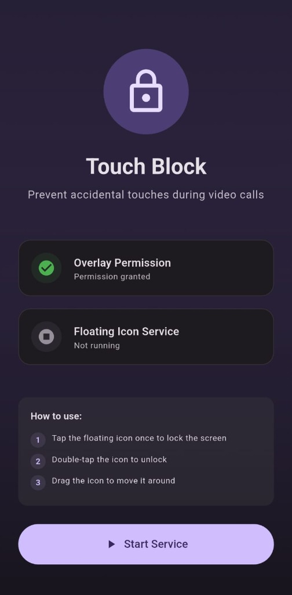
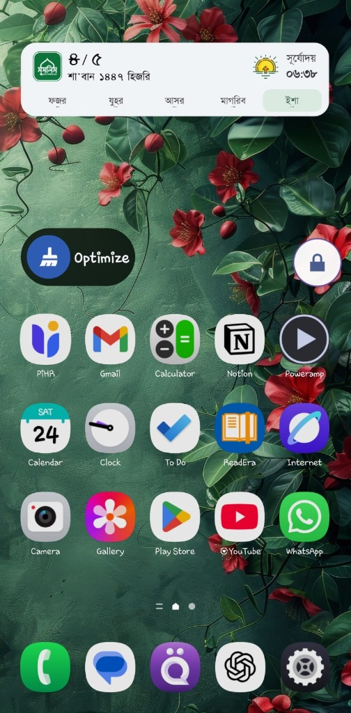
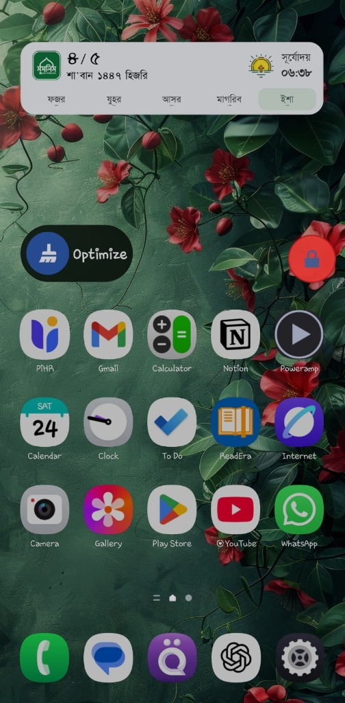

# Touch Block

<div align="center">



**Prevent accidental touches during video calls**

A Flutter Android app that blocks touch input using a floating overlay widget - perfect for keeping toddlers from ending your video calls!

[](https://drive.google.com/file/d/1CVZ1d3nissj414E0XWM_lA7EbDxHqe_T/view?usp=sharing)

</div>

---

## 📱 Features

- **Floating Overlay Icon**: Chat-head style icon that stays above all apps
- **Single-tap to Lock**: Tap once to block all screen touches
- **Double-tap to Unlock**: Tap twice to restore normal touch input
- **Draggable**: Move the floating icon anywhere on screen
- **Persistent Service**: Works across all apps (WhatsApp, Zoom, Google Meet, etc.)
- **Visual Feedback**: Icon changes color when screen is locked (red) vs unlocked (white)

---

## 🎯 Use Case

Designed for parents during video calls - prevents toddlers from accidentally:
- Ending calls
- Muting/unmuting
- Switching cameras
- Opening other apps

---

## 📸 Screenshots

| App UI | Unlocked State | Locked State |
|--------|----------------|--------------|
|  |  |  |

---

## 🚀 How to Use

1. **Install the app** from the [download link](https://drive.google.com/file/d/1CVZ1d3nissj414E0XWM_lA7EbDxHqe_T/view?usp=sharing)
2. **Grant overlay permission** when prompted (required for floating icon)
3. **Tap "Start Service"** to show the floating icon
4. **Single-tap** the floating icon → locks the screen (blocks all touches)
5. **Double-tap** the floating icon → unlocks the screen
6. **Drag** the icon to reposition it

---

## 🛠️ Technical Details

### Architecture

- **Flutter**: Modern Material 3 UI
- **Android Native (Kotlin)**: Touch blocking implementation
- **MethodChannel**: Flutter ↔ Android communication

### How Touch Blocking Works

Uses Android `WindowManager` overlays with `TYPE_APPLICATION_OVERLAY`:
- **Floating icon**: Small draggable overlay that remains interactive
- **Blocking layer**: Full-screen transparent overlay that intercepts all touch events
- **Gesture detection**: Custom single-tap/double-tap detection (300ms threshold)

### Key Components

| File | Description |
|------|-------------|
| `FloatingOverlayService.kt` | Foreground service managing overlays and touch blocking |
| `MainActivity.kt` | MethodChannel bridge for Flutter-Android communication |
| `main.dart` | Flutter UI with permission handling and service controls |

---

## ⚙️ Building from Source

### Prerequisites

- Flutter SDK (3.10.7+)
- Android Studio / VS Code
- Android SDK (API 21+)

### Build Steps

```bash
# Clone the repository
git clone <repository-url>
cd touch-block

# Get dependencies
flutter pub get

# Run on emulator/device
flutter run

# Build release APK
flutter build apk --release
```

The APK will be generated at: `build/app/outputs/flutter-apk/app-release.apk`

---

## 🔒 Permissions Required

- **SYSTEM_ALERT_WINDOW**: Draw overlays above other apps
- **FOREGROUND_SERVICE**: Keep service running in background
- **VIBRATE**: Haptic feedback on tap

---

## ⚠️ Android Limitations

> **Note**: This is an overlay-based solution, not a true system lock.

Users can still:
- Pull down the notification shade and stop the service
- Force-stop the app from Settings
- This is intentional for safety (prevents true device lockout)

---

## 📋 Requirements

- **Platform**: Android only (API 21+)
- **Android 6.0+**: Manual overlay permission required
- **Android 8.0+**: Foreground service with notification
- **Android 14+**: Special use foreground service type

---

## 🤝 Contributing

Contributions are welcome! Feel free to:
- Report bugs
- Suggest features
- Submit pull requests

---

## 📄 License

This project is open source and available under the MIT License.

---

## 👨‍💻 Author

Built with Flutter + Android native APIs (Kotlin)

---

<div align="center">

**Made with ❤️ for parents everywhere**

</div>
