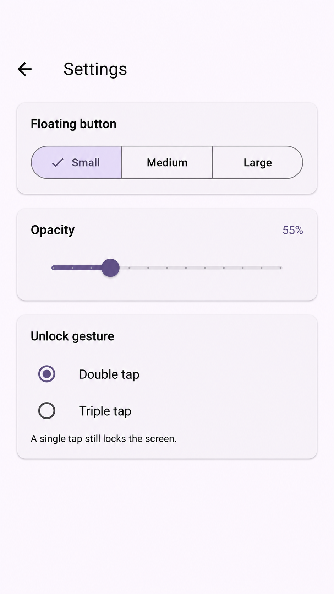

# Touch Block

<div align="center">


**Prevent accidental touches during video calls**

A Flutter Android app for parents that blocks accidental touch input during
video calls by using a floating overlay widget.

[](https://drive.google.com/file/d/1CVZ1d3nissj414E0XWM_lA7EbDxHqe_T/view?usp=sharing)

</div>

---

## Release status

- **Stable version:** `1.0.0+2`
- **Platform:** Android only (API 24+)
- **Current channel:** Google Play Closed testing (Alpha)

The current release contains the stable core overlay workflow and three focused
settings for customizing the floating icon and unlock gesture.

## 📱 Features

- **Floating Overlay Icon**: Chat-head style icon that stays above all apps
- **Single-tap to Lock**: Tap once to block all screen touches
- **Double-tap to Unlock**: Tap twice to restore normal touch input
- **Customizable Settings**: Change icon size, opacity, and Double/Triple-tap unlock
- **Draggable**: Move the floating icon anywhere on screen
- **Persistent Service**: Works across all apps (WhatsApp, Zoom, Google Meet, etc.)
- **Visual Feedback**: Icon changes color when screen is locked (red) vs unlocked (white)

---

## 🎯 Use Case

Designed for parents during video calls - prevents toddlers from accidentally:
- Ending calls
- Muting/unmuting
- Switching cameras
- Opening other apps

---

## 📸 Screenshots

| App UI | Settings | Unlocked State | Locked State |
|--------|----------|----------------|--------------|
|  |  |  |  |

---

## 🚀 How to Use

1. **Install the app** from the [download link](https://drive.google.com/file/d/1GLu5b8R6REPvnibz5iuNcb-Zzi8R7PqI/view?usp=sharing)
2. **Grant overlay permission** when prompted (required for floating icon)
3. **Tap "Start Service"** to show the floating icon
4. **Single-tap** the floating icon → locks the screen (blocks all touches)
5. Open **Settings** to change the floating button size, opacity, or unlock gesture
6. **Double-tap** or **Triple-tap** the floating icon, based on your selected setting → unlocks the screen
7. **Drag** the icon to reposition it

### Settings

- **Floating button size**: Small (48dp), Medium (56dp), or Large (64dp)
- **Floating button opacity**: 40% to 100% in 5% steps; default 95%
- **Unlock gesture**: Double tap or Triple tap; default Double tap

Single tap locks the screen in both unlock modes. The tap recognition window is
fixed at 300ms. Settings persist across app and service restarts, and size,
opacity, and unlock changes apply immediately while the foreground service is
running. Opening or editing Settings never starts the service.

---

## 🛠️ Technical Details

### Architecture

- **Flutter**: Modern Material 3 UI
- **Android Native (Kotlin)**: Touch blocking implementation
- **MethodChannel**: Flutter ↔ Android communication

### How Touch Blocking Works

Uses Android `WindowManager` overlays with `TYPE_APPLICATION_OVERLAY`:
- **Floating icon**: Small draggable overlay that remains interactive
- **Blocking layer**: Full-screen transparent overlay that intercepts all touch events
- **Gesture detection**: Custom single-tap/double-tap/triple-tap detection (300ms threshold)

### Key Components

| File | Description |
|------|-------------|
| `FloatingOverlayService.kt` | Foreground service managing overlays and touch blocking |
| `MainActivity.kt` | MethodChannel bridge for Flutter-Android communication |
| `main.dart` | Flutter UI with permission handling and service controls |

---

## ⚙️ Building from Source

### Prerequisites

- Flutter SDK (3.10.7+)
- Android Studio / VS Code
- Android SDK (API 24+)

### Build Steps

```bash
# Clone the repository
git clone <repository-url>
cd touch-block

# Get dependencies
flutter pub get

# Run on emulator/device
flutter run

# Build release App Bundle for Google Play
flutter build appbundle --release
```

The App Bundle will be generated at:
`build/app/outputs/bundle/release/app-release.aab`

---

## 🔒 Permissions Required

- **SYSTEM_ALERT_WINDOW**: Draw overlays above other apps
- **FOREGROUND_SERVICE**: Keep service running in background
- **FOREGROUND_SERVICE_SPECIAL_USE**: Declare the overlay foreground service
- **POST_NOTIFICATIONS**: Show the ongoing service notification on Android 13+
- **VIBRATE**: Haptic feedback on tap

---

## ⚠️ Android Limitations

> **Note**: This is an overlay-based solution, not a true system lock.

Users can still:
- Pull down the notification shade and stop the service
- Force-stop the app from Settings
- This is intentional for safety (prevents true device lockout)

---

## 📋 Requirements

- **Platform**: Android only (API 24+)
- **All supported versions**: Manual overlay permission required
- **Android 8.0+**: Foreground service with notification
- **Android 14+**: Special use foreground service type

---

## 🤝 Contributing

Contributions are welcome! Feel free to:
- Report bugs
- Suggest features
- Submit pull requests

---

## 📄 License

This project is open source and available under the MIT License.

---

## 👨‍💻 Author

Built with Flutter + Android native APIs (Kotlin)

---

<div align="center">

**Made with ❤️ for parents everywhere**

</div>
